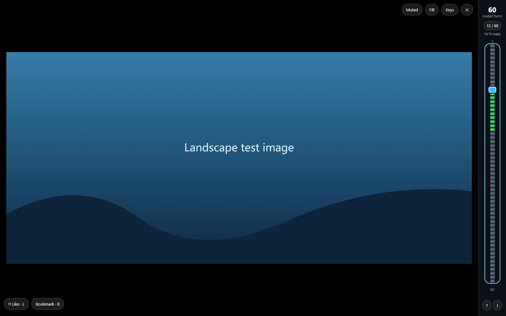

# X Reels

A Tampermonkey userscript that turns the current X timeline or search feed into a media viewer. Browse one photo or video at a time, without post captions or text-only posts.

Current version: **1.6.0**. Install the userscript directly; no build is required.



## Install

1. Install [Tampermonkey](https://www.tampermonkey.net/) in your browser.
2. Open `x-reels.user.js` in this repository and select **Raw**. Tampermonkey should offer to install it. Alternatively, paste its contents into **Dashboard → Create a new script** and save.
3. Refresh your signed-in X tab and click **Reels**, or press **Alt+Shift+R**.

To update an existing installation, replace its code and refresh X. Keep only one copy enabled. If Tampermonkey reports that userscripts are blocked, follow its browser-specific instructions.

## Controls

| Control | Action |
| --- | --- |
| Wheel / swipe / arrow keys | Browse media; larger wheel input advances further |
| Right navigation bar | Click or drag to jump through loaded media |
| Click photo or video | Open its original post in a new tab |
| **L** | Like the original post |
| **B** | Add the original post to bookmarks |
| **P** | Pause or resume video |
| **Alt+Shift+R** | Enter or exit Reels |
| **Escape** | Exit Reels |
| **Keys** button | Set your own mode shortcut |
| **Muted** / **Sound** | Toggle video sound |
| **Fill** / **Fit** | Toggle cropping or preserving the whole image |

The viewer opens again on your next visit if you left it enabled. Videos autoplay muted and loop when selected. Fit is the default, using the available screen area while preserving proportions.

Likes and bookmarks are add-only: repeated presses do not remove them. Shortcuts are ignored while typing. These actions stay in the background and show success or failure feedback; they never open a tab. Opening the original post is a separate media-click action.

## Image preloading and status bar

While Reels is open, the viewer starts downloading the **next 10 distinct images after the current item**. It skips videos and their posters, looking further ahead to find images. This is a fixed image buffer; scroll speed does not change its size. Fewer images are preloaded when fewer remain available in the loaded feed.

The buffer follows wheel, keyboard, and slider navigation and refills when new timeline data arrives. Overlapping images are reused; entries outside the new buffer are released. Closing Reels releases the buffer. The browser controls its own cache and may retain downloaded images. The viewer does not preload videos, though X's underlying page may load media independently.

| Bar appearance | Meaning |
| --- | --- |
| Blue thumb / marker | Current media item; drag the thumb to jump |
| Green marker | Image successfully downloaded in the preload buffer |
| Amber striped marker | Image download is still in progress |
| Gray image marker | Outside the preload buffer, or its preload failed |
| Gray play marker | Video; skipped by image preloading |

Hover a marker for its item number and status, including preload failures. The **ready count**, such as `8/10 ready`, counts completed images out of the current buffer. An image turns green only after it loads successfully. A failed image stays gray.

The right bar shows the current item and the total loaded media count. Multiple photos in a post count separately. Its total grows as X loads more items; it does not represent every post that might exist. With the bar focused, Home/End jump to its endpoints and Page Up/Down move ten items.

**Loaded items and ready images are different counts.** For example, `12 / 60` means you are viewing item 12 of 60 known media links; `10/10 ready` means the next ten images have downloaded. Click or drag anywhere on the bar to jump. A jump outside the buffer, a video, or slow image downloads can still cause a delay. Preloading uses additional bandwidth.

## How background actions work

When the post is still loaded, the script uses its native X button. Otherwise it sends the like/bookmark request to X's same-origin internal GraphQL API using the existing browser session. Session headers stay in page memory and are never saved, logged, exported, or sent to another service. Only viewer preferences are saved locally.

Refresh X after installation so the script can observe X's session requests. A request is sent only after an explicit **L**, **B**, or action-button press. The script checks the response before showing success and never automatically retries a write. If an action cannot be confirmed, check the original post before retrying.

## Limitations

This is an unofficial prototype. It depends on X's timeline data, native button selectors, internal action endpoint IDs, and session requirements, which may change. The script learns current action IDs when X uses them on the page; bundled fallback IDs may become outdated. Account restrictions, unavailable media, autoplay policies, and rate limits still apply.

The current version passed local browser tests with synthetic timeline data, playable video, simulated native buttons, and mocked API responses. **Live signed-in X API acceptance has not been verified.** The preview uses a test image.

## Development and tests

Requires Node.js and npm. No build is needed for the userscript.

```sh
npm install
npx playwright install chromium
npm run check
npm test
```

Tests use isolated browser contexts and intercept network requests. They do not sign in, use real credentials, or perform actions on a real account. Coverage includes media extraction, autoplay, scrolling, source links, shortcuts, slider navigation, responsive layout, native actions, background actions, duplicate presses, response errors, and session-header handling. Preload tests check the ten-image buffer, video/poster exclusion, reuse, refilling, cleanup on exit, pending and successful downloads, failed downloads, marker states, and the ready count.

To test with an installed browser, set `PLAYWRIGHT_CHANNEL` to a supported Playwright browser channel such as `msedge`.

The included GitHub Actions configuration, `.github/workflows/test.yml`, runs syntax checks and the browser tests on pushes and pull requests using Chromium. It must be uploaded to GitHub before it can run; local test results do not imply that a GitHub Actions run passed.

## Recent changes

- **1.6.0:** Colored preload markers, ready count, and item-status tooltips on the right navigation bar.
- **1.5.0:** Rolling preload buffer for the next ten images, excluding videos and video posters.
- **1.4.0:** Background likes and bookmarks without opening an action tab.


